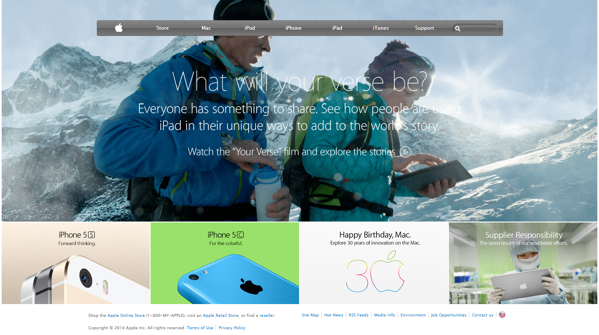

# Apple Clone Solo Project

> This is basically an exercise to match an Apple site using different techniques.

I have been trying to use flex-box mainly.

## Built With

- HTML5,
- CSS3

## Live Demo

[Live Demo Link](https://rawcdn.githack.com/Daniduran-dev/apple-clone-solo/e0c4db119efbe0035dde542da7c6edd37d58c938/index.html)

## Authors

👤 **Author1**

- Github: [@githubhandle](https://github.com/Daniduran-dev)

## 🤝 Contributing

Contributions, issues and feature requests are welcome!

Feel free to check the [issues page](issues/).

## Show your support

Give a ⭐️ if you like this project!

## Acknowledgments

- Apple

## 📝 License

This project is [MIT](lic.url) licensed.
